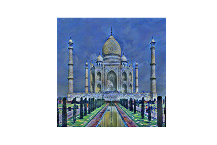
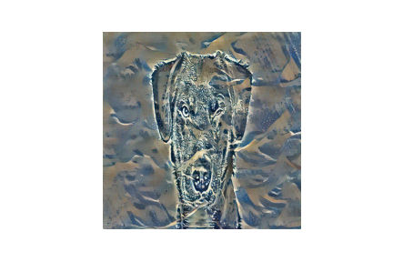
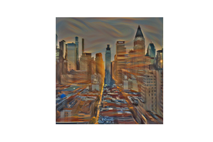

# Neural Style Transfer Using CNN

A deep learning project that transfers the styles of one image to another.
Project build using the PyTorch library and the VGG19 model.

## Some outputs

## Credits

This project is the implementation of the original paper [A Neural Algorithm of Artistic Style](https://arxiv.org/abs/1508.06576). The project is also inspired by this [PyTorch tutorial](https://pytorch.org/tutorials/advanced/neural_style_tutorial.html). It is also worth mentioning this amazing [blog post](https://medium.com/data-science-group-iitr/artistic-style-transfer-with-convolutional-neural-network-7ce2476039fd) which helped me understand the basic theory behind the algorithm.